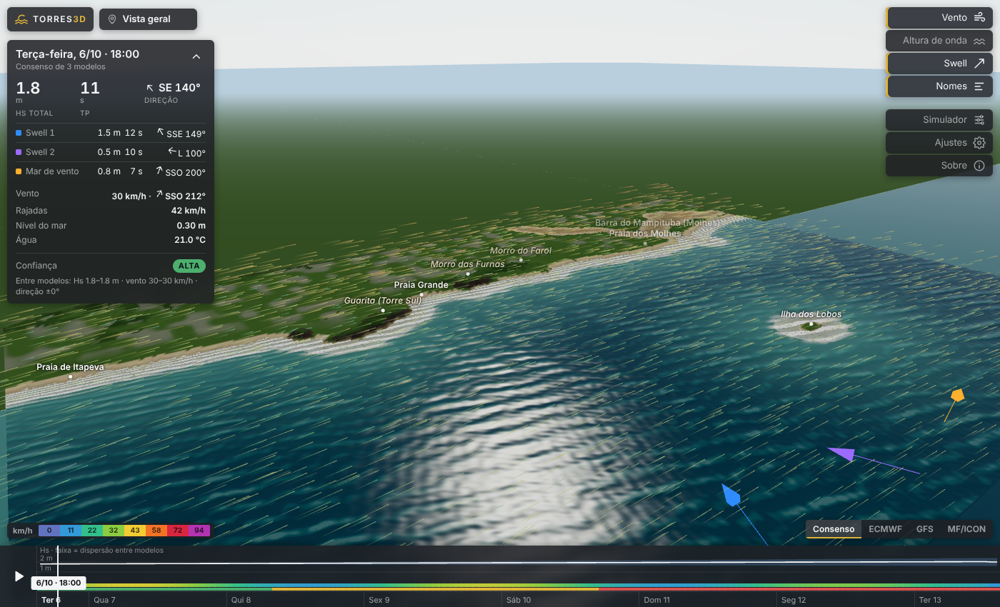

# Torres 3D – ondas, swell e vento

Protótipo open source de visualização 3D da previsão de ondas e vento para as praias de Torres (RS). Roda no navegador (WebGL), sem servidor próprio, e consome dados abertos da Open-Meteo.



O que aparece na cena:

- Superfície do mar animada, sintetizada a partir das partições previstas (swell primário, swell secundário e mar de vento), com refração, empinamento (shoaling) e arrebentação na costa.
- Vento em 3D no estilo Windy: partículas transportadas pelo campo previsto, com perfil logarítmico na vertical, rugosidade diferente para mar e terra e soerguimento sobre o relevo.
- Três conjuntos de modelos (ECMWF WAM + IFS, NOAA GFS-Wave + GFS, Météo-France MFWAM + DWD ICON) e o consenso entre eles, com seletor no estilo Windy.
- Escala de confiança por hora (alta, média, baixa), calculada a partir da concordância entre os modelos em altura, direção das ondas e vento; o meteograma da linha do tempo mostra a faixa de dispersão de Hs.
- Linha do tempo de 7 dias (hora a hora) com meteograma, nível do mar (maré + componente meteorológica) e temperatura da água.
- Modo "cenário manual", com presets (ressaca de sul, nordestão, swell de leste com terral, mar calmo), para demonstrações e estudos de caso.
- Camadas: mapa de Hs costeiro, setas de swell, nomes das praias, exagero vertical e câmeras pré-definidas (Praia Grande, Guarita, Molhes, Ilha dos Lobos).

## Como rodar

O app é um site estático. Basta servir a pasta por HTTP, porque módulos ES não funcionam abrindo o arquivo direto:

```bash
python -m http.server 8000
# abrir http://localhost:8000
```

Parâmetros de URL:

- `?q=alta|media|baixa`: resolução da malha do oceano e número de partículas. O padrão é `media` em celulares.
- `?cam=Guarita`: abre direto numa câmera pré-definida.

Versão publicada: **https://joaolague.github.io/torres3d/** (GitHub Pages, branch `gh-pages`). Para publicar uma atualização, envie o mesmo commit para a branch `gh-pages` (`git push origin main:gh-pages`).

### Relevo

O relevo já vem no repositório: `data/terrain.json`, gerado a partir do Copernicus DEM GLO-30 (30 m), em grade de 25 m. Sem esse arquivo, o app tenta baixar o DEM de 90 m pela Open-Meteo e, se não conseguir, usa um relevo procedural aproximado.

Para regenerar o relevo ou usar um MDT melhor (LiDAR, drone):

```bash
pip install numpy rasterio pyproj
python tools/build_terrain.py                              # Copernicus 30 m (AWS Open Data)
python tools/build_terrain.py --geotiff mdt_torres.tif --dx 10
python tools/build_terrain.py --source openmeteo --dx 75   # sem rasterio; lento (limite da API gratuita)
```

## Como funciona

```
Open-Meteo Marine (Hs, Tp, Dir por partição, nível do mar)   Open-Meteo Forecast (vento 10 m, grade 3x3)
        │                                                          │
        ▼                                                          ▼
spectrum.js: JONSWAP + espalhamento cos^2s             wind.js: interpolação bilinear, perfil log,
  → até 64 componentes lineares                         rugosidade mar/terra, w = U·∇z
  → fase integrada na normal à costa (tabela na GPU)    → partículas 3D com rastro
        │
        ▼
ocean.js (vertex shader), em cada vértice:
  dispersão k(h), Snell (refração), Ks (shoaling), corte por quebra Hs ≤ γ·h, espuma
        │
terrain.js: MDT + batimetria sintética de Dean h = A·d^(2/3) (d = distância à linha de costa)
```

Escolhas e limitações, para deixar claro em qualquer apresentação:

1. A superfície é uma realização estocástica consistente com o espectro previsto, não a previsão de cada onda. É o mesmo raciocínio de uma simulação condicional: as estatísticas (Hs, Tp, direção) são respeitadas e a fase é aleatória.
2. A batimetria é sintética: um perfil de equilíbrio de Dean com A = 0,10 m^1/3. Ela deve ser substituída por GEBCO, cartas náuticas da DHN ou levantamento batimétrico. É o fator que mais limita a precisão perto da costa.
3. A refração assume isóbatas paralelas e localmente retas. Não há difração atrás dos promontórios nem da Ilha dos Lobos, nem correntes de retorno. Isso exige um modelo espectral costeiro (SWAN) ou de fase resolvida (SWASH, FUNWAVE). Ver o roadmap.
4. O vento vem da interpolação de modelos globais (resolução de ~10–25 km). O efeito do relevo é só cinemático.
5. A confiança mede só a concordância entre modelos globais; não inclui o erro da transformação costeira nem o estado dos bancos de areia. Com um único modelo disponível, aparece como "n/d".
6. Os morros e a barra do Mampituba foram posicionados a partir do DEM. Os nomes das praias e a Ilha dos Lobos (ausente no DEM e inserida como feição simplificada) têm posição aproximada.
7. O Copernicus DEM é um modelo de superfície (DSM): prédios e vegetação aparecem como relevo.

## Estrutura

```
index.html, css/style.css
js/geo.js      sistemas de coordenadas, marcos, câmeras
js/terrain.js  MDT, máscara de oceano, distância (EDT), batimetria, malhas
js/spectrum.js síntese espectral, dispersão, tabela de fase
js/ocean.js    shaders do oceano
js/wind.js     campo de vento e partículas
js/data.js     Open-Meteo e cenários manuais
js/main.js     cena, interface e loop
tools/build_terrain.py
```

## Roadmap sugerido

| Fase | Entrega | Observação |
|---|---|---|
| 0. Protótipo (este) | Visualização 3D com dados abertos | Custo zero |
| 1. Batimetria real | GEBCO + cartas DHN digitalizadas, ou batimetria derivada de satélite (Sentinel-2) | Maior ganho de realismo |
| 2. Downscaling SWAN | Catálogo de cenários (Hs × Tp × Dir × vento) rodado offline; interpolação ou metamodelo em operação | Hs, direção e quebra por praia |
| 3. Validação | Comparação com boia (PNBOIA/SiMCosta), webcams e observação local | Métricas de viés e RMSE por pico |
| 4. Pipeline próprio | Ingestão de GFS-Wave / ECMWF / Copernicus Marine em Python (xarray, cfgrib), saída em Zarr | Independência da Open-Meteo e uso comercial |
| 5. Produto | Alertas, risco de corrente de retorno, API B2B, outras praias do litoral norte | Modelo open core |

## Dados, licenças e custos

O código está sob licença MIT (ver `LICENSE`). Os dados têm licenças próprias, e a atribuição deve ser mantida:

| Fonte | Uso | Licença / custo |
|---|---|---|
| [Open-Meteo](https://open-meteo.com) (Marine, Forecast, Elevation) | Ondas, nível do mar, vento, MDT | CC BY 4.0. Gratuita para uso não comercial; uso comercial requer plano pago |
| Copernicus DEM GLO-30 / GLO-90 (© DLR e Airbus, Copernicus) | Relevo | Licença Copernicus DEM, livre com atribuição |
| [three.js](https://threejs.org) | Motor 3D | MIT |

Nesta fase o projeto não tem custo. Para comercializar: assinar o plano comercial da Open-Meteo ou montar o pipeline próprio da fase 4 (os dados NOAA, ECMWF Open Data e Copernicus Marine são gratuitos, mas exigem um servidor de ~US$ 50–300/mês).

Aviso: ferramenta de visualização. Não substitui avisos oficiais da Marinha, da Defesa Civil ou dos guarda-vidas, e não deve ser usada para decisões de segurança no mar.
